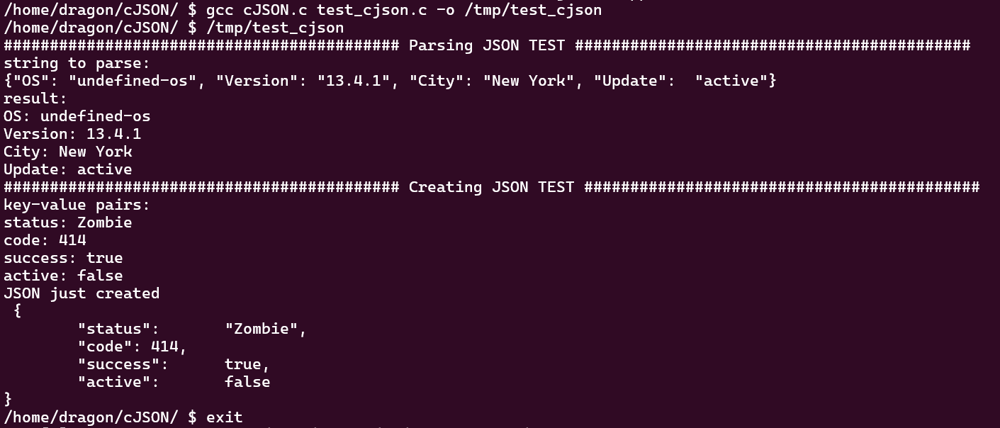

# cc

简单编译测试：

```
gcc a.c -o /tmp/a
/tmp/a
```

复杂项目测试（cJSON）：

cJSON是一个使用C语言编写的JSON数据解析器，具有超轻便，可移植的特点，我们编写了一个c语言测试程序，使用该库，实现了简单的JSON的序列化和反序列化操作，以测试gcc能否正确运行。

```
cd cJSON
gcc cJSON.c test_cjson.c -o /tmp/test_cjson
/tmp/test_cjson
```


