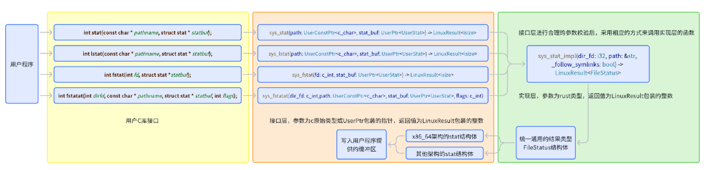
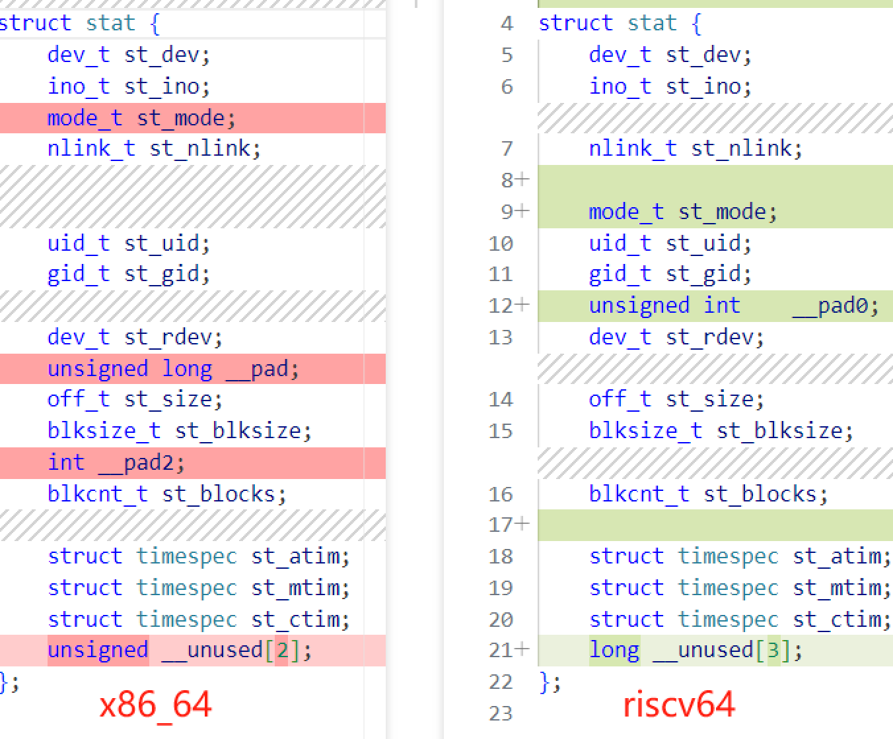

# stat系列syscall开发

## `syscall`实现
```rust
pub fn sys_stat(path: UserInPtr<c_char>, stat_buf: UserOutPtr<UserStat>) ;
pub fn sys_lstat(path: UserInPtr<c_char>, stat_buf: UserOutPtr<UserStat>) ;
pub fn sys_fstat(fd: c_int, stat_buf: UserOutPtr<UserStat>);
pub fn sys_fstatat(
    dir_fd: c_int,
    path: UserInPtr<c_char>,
    stat_buf: UserOutPtr<UserStat>,
    flags: c_int,
) ;
pub fn sys_statx(
    dir_fd: c_int,
    path: UserInPtr<c_char>,
    flags: c_int,
    _mask: c_uint,
    statx_buf: UserOutPtr<UserStatX>,
);
```
## 实现设计

| 系统调用       | 参数类型                                                                 | 符号链接处理                     | 路径类型         | 特殊功能                                                                 |
|----------------|--------------------------------------------------------------------------|----------------------------------|------------------|--------------------------------------------------------------------------|
| **sys_stat**   | 路径                        | 跟随符号链接，获取目标文件信息   | 绝对/相对路径    | 获取文件元数据（如大小、权限、时间戳），适用于普通文件和目录             |
| **sys_lstat**  | 路径                            | 不跟随符号链接，获取链接本身信息 | 绝对/相对路径    | 专门用于获取符号链接本身的元数据，而非其指向的文件                       |
| **sys_fstat**  | 文件描述符                                      | 不涉及符号链接，直接操作文件描述符 | 文件描述符       | 通过文件描述符获取已打开文件的元数据，适用于无法通过路径访问的文件       |
| **sys_fstatat**| 文件描述符+路径        | 取决于 `flags`（`AT_SYMLINK_NOFOLLOW` 控制是否跟随符号链接） | 相对路径（相对于 dirfd）或绝对路径 | 支持相对路径、符号链接控制、以及在指定目录描述符下操作，灵活性更高       |
| **sys_statx**  | 文件描述符+路径 | 取决于 `flags`（`AT_SYMLINK_NOFOLLOW` 控制是否跟随符号链接） | 绝对/相对路径（相对于 dirfd） | 提供更细粒度的元数据控制（通过 mask 指定所需字段），支持扩展属性和未来功能 |

实现的过程中，尽力符合之前提出的`用户程序-用户C库接口-系统调用接口层-实现层`的结构。



## 开发经历

- `UserStat`结构体在不同架构表现为字段顺序不同，字段大小不同，结构体总长度不同，图中的子类型长度也不一致，例如mode_t的长度也不相同，最初仅仅支持`x86_64`架构导致了错位，之后我们添加了全架构正确的结构体之后问题解决。

